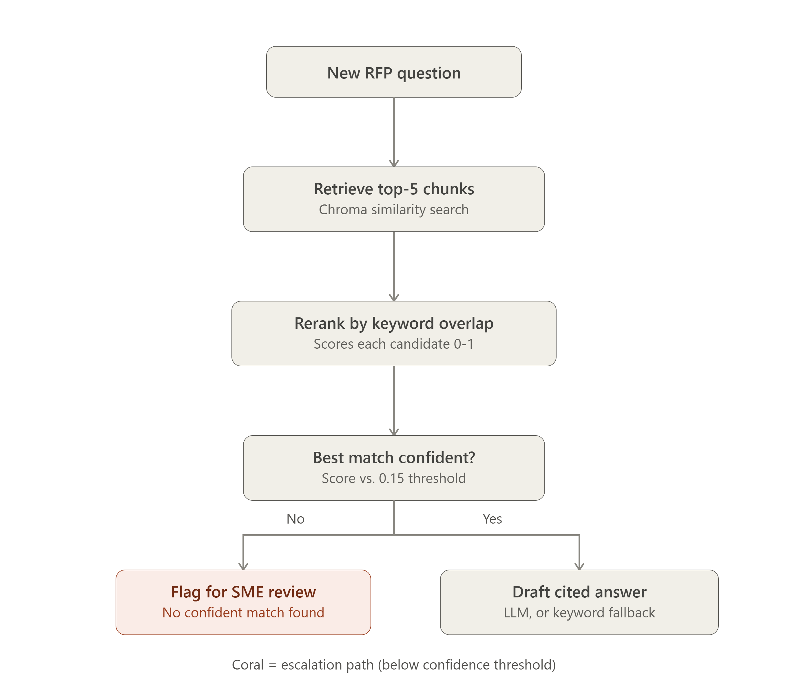

# Agentic RAG Demo

A compact, interview-friendly agentic retrieval-augmented generation (RAG) assistant. It answers questions over a small local document set using a multi-step workflow rather than a single retrieve-then-answer call.

## How it works

1. **Retrieve** — the agent pulls candidate passages from a local Chroma vector store.
2. **Rerank** — a lightweight reranking step narrows the candidates down to the most relevant passages.
3. **Answer** — a free, open-source language model generates the final answer using only the reranked evidence.

If the local free-model generation backend is unavailable at runtime, the app falls back to a grounded evidence summary instead of failing outright.

## Project structure

```
.
├── app.py                # Entry point for the Gradio app
├── app/
│   ├── main.py            # Runs the full demo end-to-end
│   ├── agent.py            # Agent graph and prompt orchestration
│   └── retriever.py        # Vector store creation, retrieval, and reranking
├── agents/                # Agent definitions
├── data/knowledge/        # Sample source documents (e.g. an invoice, a resume, a support ticket)
├── .chroma_db/             # Local persisted vector store
├── requirements.txt
└── .env.example
```

## Why this architecture

### Chunking strategy

The knowledge base is split with `RecursiveCharacterTextSplitter` at roughly 600 characters with 120 characters of overlap. This balances two goals:

- keeping local context coherent for a single business record or ticket
- avoiding overly aggressive chunking, which would lose important references and reduce answer quality

### Retrieval method

The app uses **Chroma** as the vector database and open-source embeddings to build dense vector representations of each chunk. This keeps the demo fast, fully local, and easy to inspect from the browser or terminal — no external services required for retrieval.

### Why rerank

Dense retrieval alone is often noisy: it surfaces passages that are semantically similar but not necessarily useful for the literal question asked. The reranking step adds a second signal that rewards passages relevant to the actual query, producing answers that are more grounded and less prone to hallucination.

## Getting started

### Prerequisites

- Python 3.11
- pip

### Installation

```bash
git clone https://github.com/angkit-hash/Intelligent_agents.git
cd Intelligent_agents
pip install -r requirements.txt
```

### Configuration

Copy the example environment file and adjust values as needed:

```bash
cp .env.example .env
```

No API key is required for the default free-model path.

### Run the app

```bash
python app/main.py
```

This launches the Gradio interface locally, where you can ask questions against the sample documents in `data/knowledge/`.

## Adding your own documents

Drop additional files into `data/knowledge/` and re-run the ingestion step (see `app/retriever.py`) to rebuild the vector store before starting the app.

## Roadmap ideas

- Swap in a hosted LLM provider as an optional backend

## Workflow


